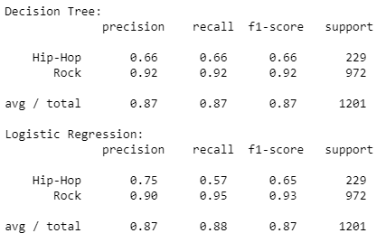

# Classify-Song-Genres-from-Audio-Data

### Table of Contents

- [Description](#description)
- [Process](#analysis)
- [Results](#results)
- [Project Layout](#project-layout)
- [References](#references)
- [Author Info](#author-info)

---

## Description

<br>
Over the past few years, streaming services with huge catalogs have become the primary means through which most people listen to their favorite music. But at the same time, the sheer amount of music on offer can mean users might be a bit overwhelmed when trying to look for newer music that suits their tastes.

For this reason, streaming services have looked into means of categorizing music to allow for personalized recommendations. One method involves direct analysis of the raw audio information in a given song, scoring the raw data on a variety of metrics. Today, we'll be examining data compiled by a research group known as The Echo Nest. Our goal is to look through this dataset and classify songs as being either 'Hip-Hop' or 'Rock' - all without listening to a single one ourselves. In doing so, we will learn how to clean our data, do some exploratory data visualization, and use feature reduction towards the goal of feeding our data through some simple machine learning algorithms, such as decision trees and logistic regression.

To begin with, let's load the metadata about our tracks alongside the track metrics compiled by The Echo Nest. A song is about more than its title, artist, and number of listens. We have another dataset that has musical features of each track such as danceability and acousticness on a scale from -1 to 1. These exist in two different files, which are in different formats - CSV and JSON. While CSV is a popular file format for denoting tabular data, JSON is another common file format in which databases often return the results of a given query.

### Built With

- Pandas
- scikit-learn

### For Execution

Download the file and resources into a folder and run it

---

## Analysis

### Confusion Matrix  
<p align="center">
    
</p>

### Without Balancing Data

<p align="center">
    
</p>
<p align="justify">
Both our models do similarly well, boasting an average precision of 87% each. However, looking at our classification report, we can see that rock songs are fairly well classified, but hip-hop songs are disproportionately misclassified as rock songs. Why might this be the case? Well, just by looking at the number of data points we have for each class, we see that we have far more data points for the rock classification than for hip-hop, potentially skewing our model's ability to distinguish between classes. This also tells us that most of our model's accuracy is driven by its ability to classify just rock songs, which is less than ideal.

To account for this, we can weight the value of a correct classification in each class inversely to the occurrence of data points for each class. Since a correct classification for "Rock" is not more important than a correct classification for "Hip-Hop" (and vice versa), we only need to account for differences in sample size of our data points when weighting our classes here, and not relative importance of each class.
</p>

### After Balancing Data

<p align="center">
    
</p>

---

## Results
<p align="justify">
Balancing our data has removed bias towards the more prevalent class. To get a good sense of how well our models are actually performing, we can apply what's called cross-validation (CV). This step allows us to compare models in a more rigorous fashion.

Since the way our data is split into train and test sets can impact model performance, CV attempts to split the data multiple ways and test the model on each of the splits. Although there are many different CV methods, all with their own advantages and disadvantages, we will use what's known as K-fold CV here. K-fold first splits the data into K different, equally sized subsets. Then, it iteratively uses each subset as a test set while using the remainder of the data as train sets. Finally, we can then aggregate the results from each fold for a final model performance score.
</p>
<p align="center">
    
</p>


#### [Back To The Top](#Classify-Song-Genres-from-Audio-Data)

---

## Project Layout

```
Classify-Song-Genres-from-Audio-Data
├─ after_balance.PNG
├─ Code.ipynb
├─ correlation_matrix.PNG
├─ datasets
│  ├─ echonest-metrics.json
│  └─ fma-rock-vs-hiphop.csv
├─ README.md
├─ resu.PNG
└─ without_balancing.PNG

```

---

## References

- [Pandas](https://pandas.pydata.org/)
- [Matplotlib](https://matplotlib.org/)
- [DecisionTreeClassifier](https://scikit-learn.org/stable/modules/generated/sklearn.tree.DecisionTreeClassifier.html)
- [DecisionTreeClassifier](https://scikit-learn.org/stable/modules/generated/sklearn.linear_model.LogisticRegression.html)
---

## Author Info

- LinkedIn - [Srinivas K](https://www.linkedin.com/in/srinivas-konduri/)
- Github - [Srinivas K](https://github.com/srinivaskool)

#### [Back To The Top](#Classify-Song-Genres-from-Audio-Data)

